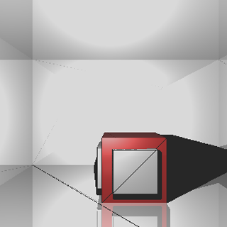

# Data_Visu
Data visualisation project for HPC-AI specialized Master in Mines Paristech

In this project we developed an application in PyQt and VTK for applying a
Raytracing algorithm to a pre-build scene. This pre-build scene is interactive
and the user can change the light and the camera positions, as well as the image
resolution and the number of reflexions, in order to configure the final
rendered image.

Below, we have an example of the image generated by the application using the
raytracing:

